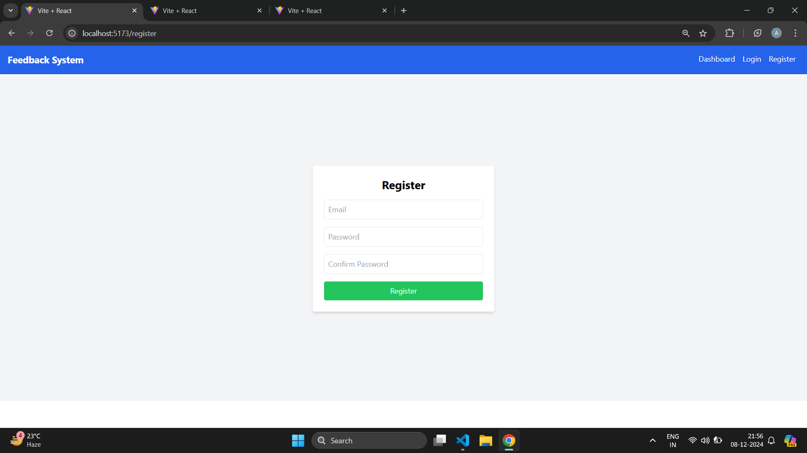
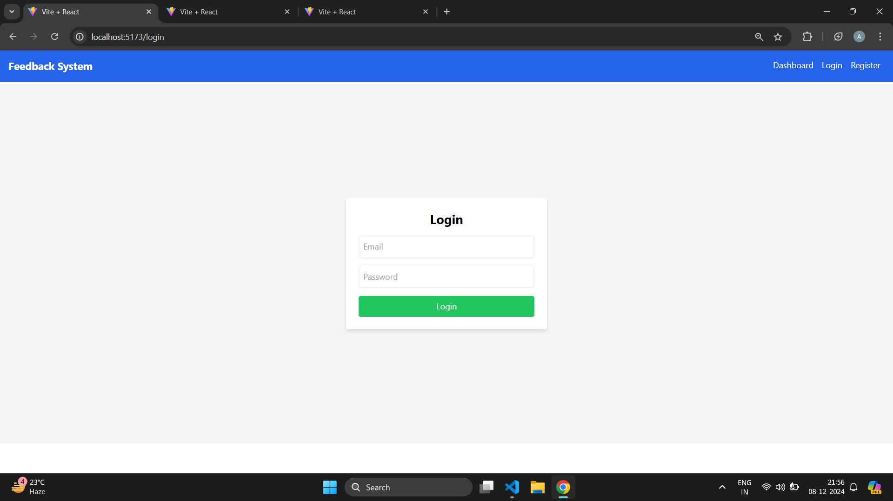
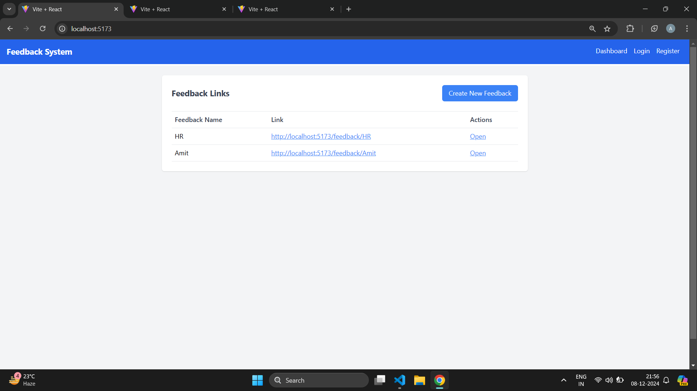
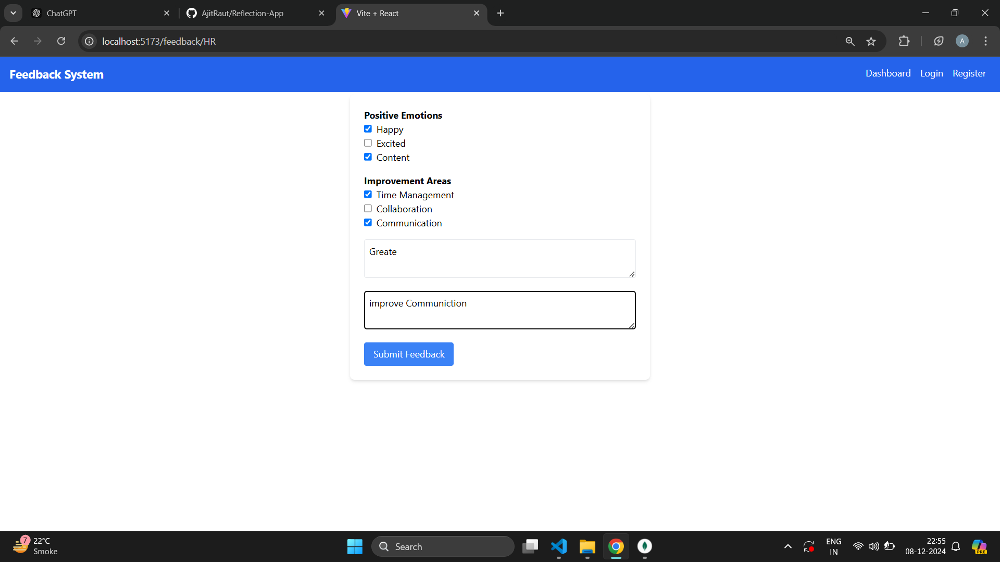
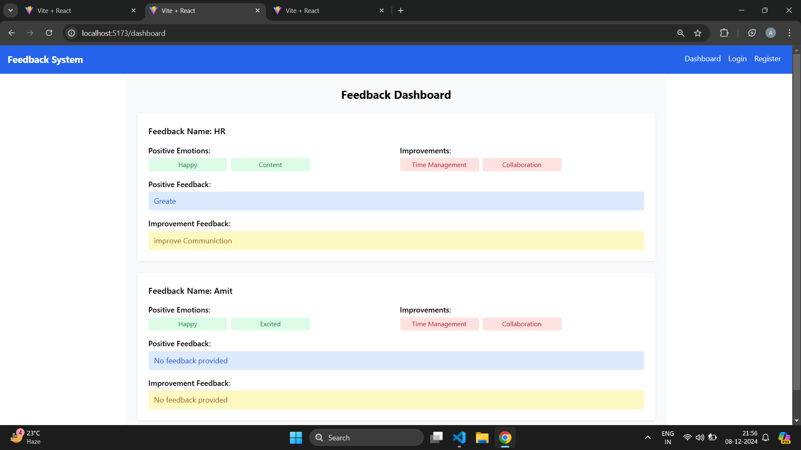
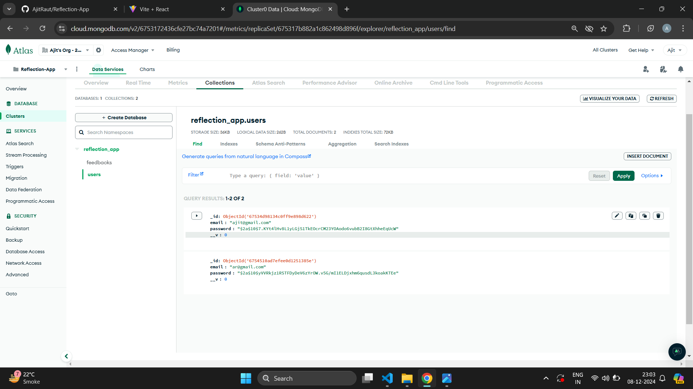
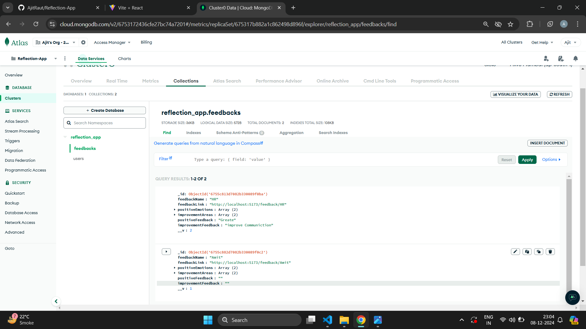

This application allows users to register, generate unique feedback collection links, and view anonymous feedback on a dashboard. It was developed for the ThinkQuotient Coding Challenge, focusing on simplicity and user-friendliness.

---

## **Features**

1. **User Registration and Login**  
   - Users can register with an email and password.
   - Authenticated users can log in to access the application.

2. **Feedback Link Generation**  
   - After logging in, users can create a unique link to collect feedback.

3. **Anonymous Feedback Submission**  
   - Participants can submit feedback without logging in.
   - A "Thank You" message confirms submission.

4. **Feedback Dashboard**  
   - Users can view all feedback submissions in an organized, anonymous format.

---

## **Screenshots**

### Registration Page  


### Login Page  


### Feedback Link Generation Page  


### Feedback Submission Page  


### Dashboard View  


### User database


### FeedBack database

---

## **Tech Stack**

- **Frontend**: React
- **Backend**: Node.js, Express.js
- **Database**: MongoDB 
- **Styling Framework**: Tailwind CSS  

---

## **Setup and Installation**

### Prerequisites  
- Node.js and npm installed.  
- MongoDB or the chosen database installed and running.

### Steps to Run the Project Locally  
1. Clone the repository:  
   ```bash
   git clone <repository-url>
   cd reflection-application
   
Install dependencies for the backend and frontend:

For the backend:

bash
Copy code
cd server
npm install
For the frontend:

bash
Copy code
cd client
npm install
Set up environment variables for your application:

Create a .env file in the server folder with your MongoDB connection string and other required environment variables.
Start the backend server:

bash
Copy code
cd server
npm start
Start the frontend development server:

bash
Copy code
cd client
npm start
Open your browser and visit http://localhost:3000 to access the application.

Usage
Register: Sign up using an email and password.
Log in: Use your credentials to access the application.
Create Feedback Link: After logging in, create a unique link for collecting feedback.
Share the Feedback Link: Distribute the link to participants who can provide feedback without logging in.
View Feedback: Access your feedback dashboard to see all submitted responses.
Version Information
Node.js: v16.x
React: v18.x
MongoDB: v6.x
Database Schema
Collections
Users
Stores user data: email, password (hashed).
Feedback Links
Contains unique identifiers for feedback links and associated user IDs.
Feedback Submissions
Stores feedback responses anonymously.
Assumptions
Feedback links are permanent unless deleted by the user.
Participants do not require authentication to submit feedback.
Feedback submissions are stored anonymously.
Sharing feedback links externally (via email/WhatsApp) is handled outside the application.
Challenges and Solutions
Challenges
Ensuring feedback remains anonymous.
Generating secure, unique feedback links.
Solutions
Used a random unique identifier (UUID) for link generation.
Designed the database schema to exclude identifiable participant data.
Future Enhancements
Add expiration dates for feedback links.
Include analytics for submitted feedback (e.g., trends).
Allow users to export feedback as CSV or Excel files.
Deployment
The application is deployed at: [Deployment URL, if applicable]

Steps to access the live version:
Open the deployment URL in a browser.
Register or log in to use the application.
Additional Notes
Feedback is stored securely in the database and cannot be traced back to participants.
Users are responsible for sharing feedback links externally.
Author
Ajit Raut
Email: [Your Email Address]
LinkedIn: [Your LinkedIn Profile]

markdown
Copy code

### Key Sections:

1. **Setup and Installation**:  
   Added the full set of steps for installing the project locally, including setting up the backend and frontend, installing dependencies, creating the `.env` file, and running both servers.

2. **Usage**:  
   Outlined how to use the application (register, log in, generate links, share links, and view feedback).

3. **Tech Stack and Version Info**:  
   Lists the technologies and versions used in your project.

4. **Database Schema**:  
   Provides an overview of your MongoDB collections (Users, Feedback Links, and Feedback Submissions).

5. **Challenges and Solutions**:  
   Mentions challenges faced during development and how they were addressed.

6. **Future Enhancements**:  
   Lists potential features for future updates.

7. **Deployment**:  
   Includes steps to access the deployed application, if applicable.

### Customization:
- Replace `<repository-url>`, `[Your Email Address]`, and `[Your LinkedIn Profile]` with your actual details.
- Ensure that the images are stored in the appropriate `public/assets/images` directory and referenced correctly.

Let me know if you need more help with this!